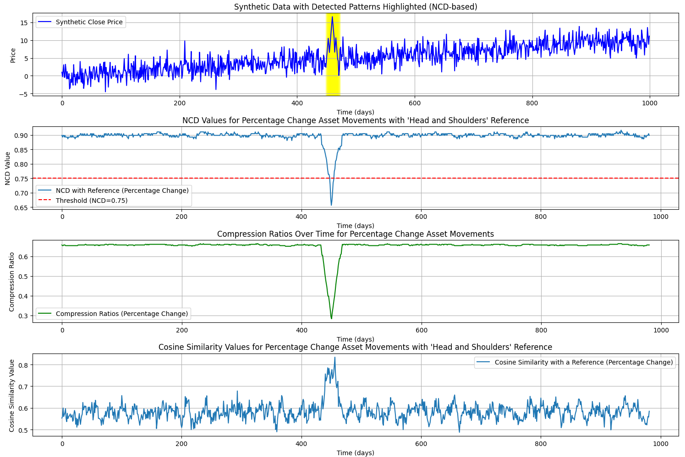
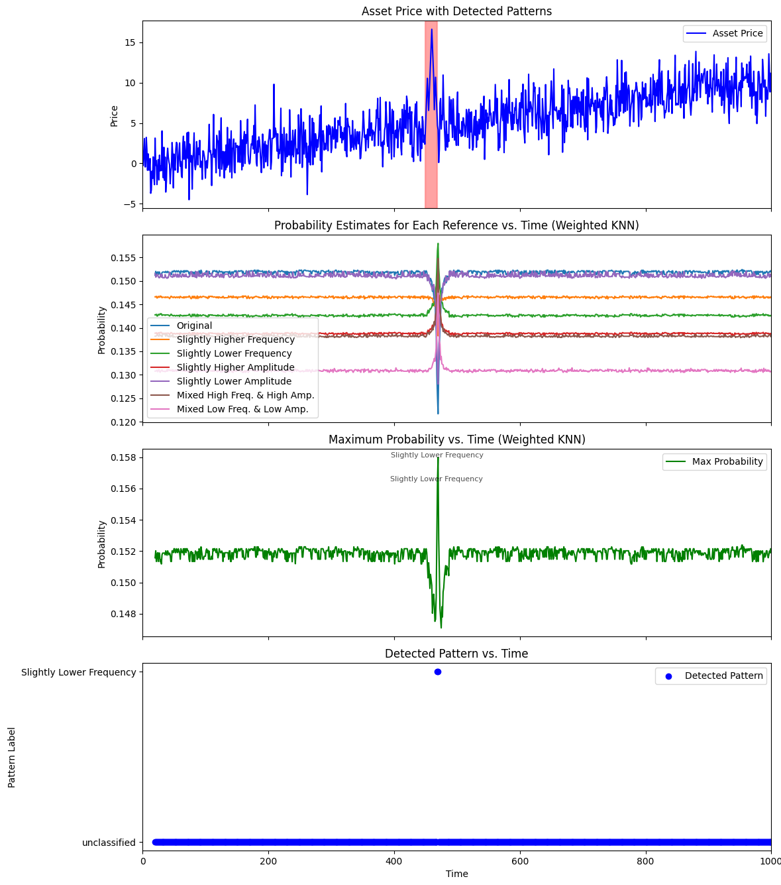

# Financial Data Pattern Recognition Using The Analysis Of Compressed Representation Of Time Series

## Introduction
An approach to recognizing patterns in financial data by analyzing its compressed representation, diverging from
traditional methods due to the potential for increased efficiency.

This particular method could be easily adopted with
hardware accelerators.

The current implementation works exclusively on synthetic data generated by the `generate_synthetic_data` function.

## Original White Paper
Please refer to: Zhiying Jiang, Matthew Y.R. Yang, Mikhail Tsirlin, Raphael Tang, Yiqin Dai, and Jimmy Lin 2023.
“Low-Resource” Text Classification: A Parameter-Free Classification Method with Compressors -
[link to the Paper](https://aclanthology.org/2023.findings-acl.426.pdf).

This project is inspired by a method of text classification using compression techniques.
The original paper explores text classification with a focus on compressors, including gzip, and their application
in various settings, such as cross-entropy and kNN methods.

## Background
While the inspiration for this project stems from the [ACL 2023 paper](https://aclanthology.org/2023.findings-acl.426)
on text classification using compressors, this approach is distinct. Instead of directly classifying text, we focus
on quantifying and identifying patterns in financial data by examining its compressed representation.

Compression techniques are particularly suited for financial data because they can capture intricate patterns
and redundancies, providing a condensed yet informative view of the data.

## Methodology
- **Synthetic Data generation**: Synthetic financial datasets with embedded "Head and Shoulders" patterns are generated
    for testing and validation. This is an extremely simple approach.
- **Analysis of Compressed Data**: Examination of financial data in its compressed form. 
    - Compression algorithms inherently capture the underlying patterns within input data, making this approach crucial
      for unearthing and understanding these patterns and associated trends.
- **Compression-Based Metrics**: The Normalized Compression Distance (NCD) and Compression Ratio of the pattern + window
    derive the insights from the compressed data. These metrics are chosen because they provide a standardized way
    to quantify the efficiency and pattern similarities in compressed data.
- **Cosine Similarity**: We calculate the cosine similarity between compressed financial data patterns and the
    reference pattern. This measure helps determine the similarity between the two patterns, with values closer to 1
    indicating higher similarity.

## Usage
Execute `main.py` to run the pattern recognition on synthetic data and visualize the results.

## Known Issues
- The detection mechanism is tailored to work **exclusively** with the simplest form of synthetic data generated with
  `generate_synthetic_data` function.
- At this moment, even a simple trend `generate_synthetic_data_with_trend` makes the detection fail.

## Future Work
The project is in its early stages and is open to refinements. Feedback and collaboration are encouraged, especially
to enhance the methodology and address current limitations.

## Test output

Test output

Test output knn

